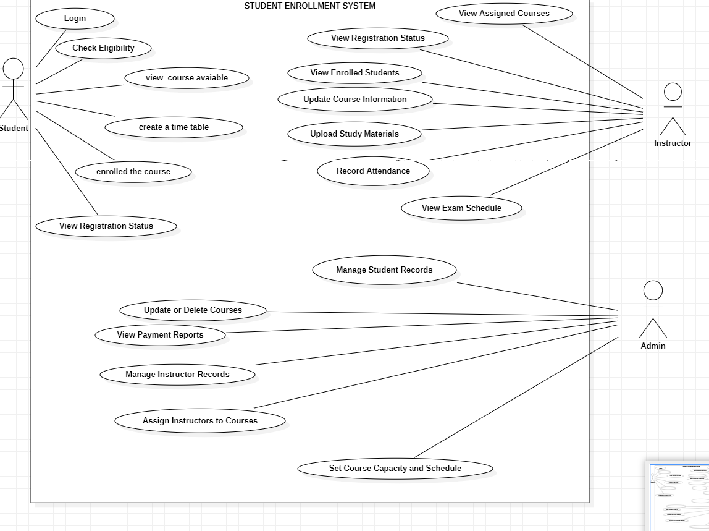
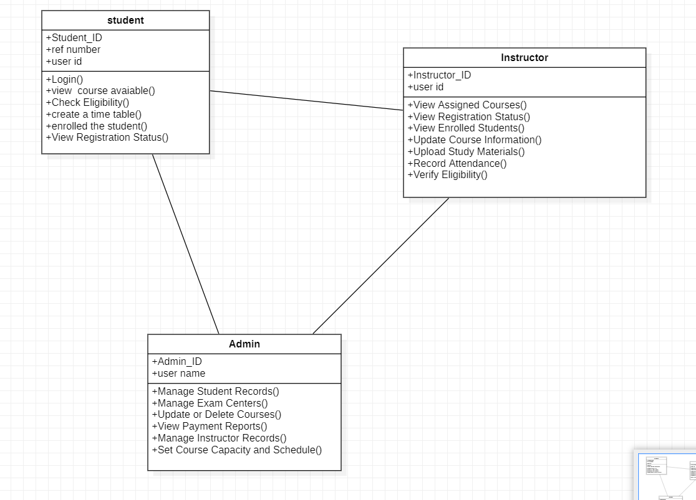
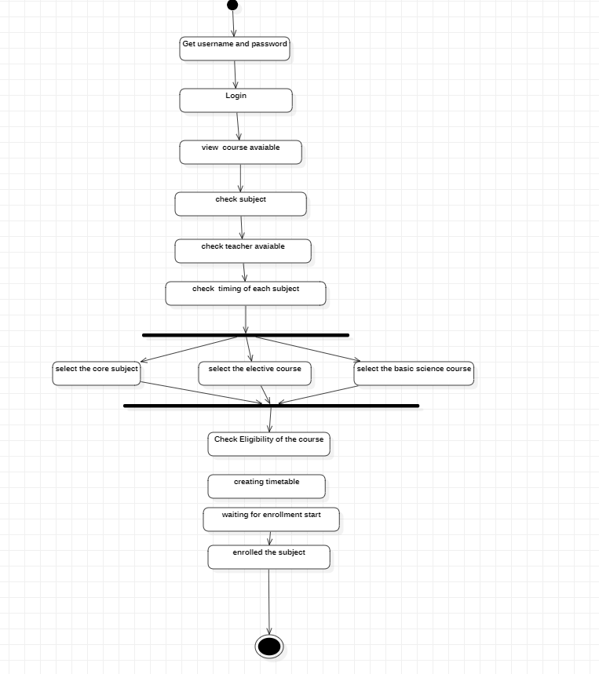
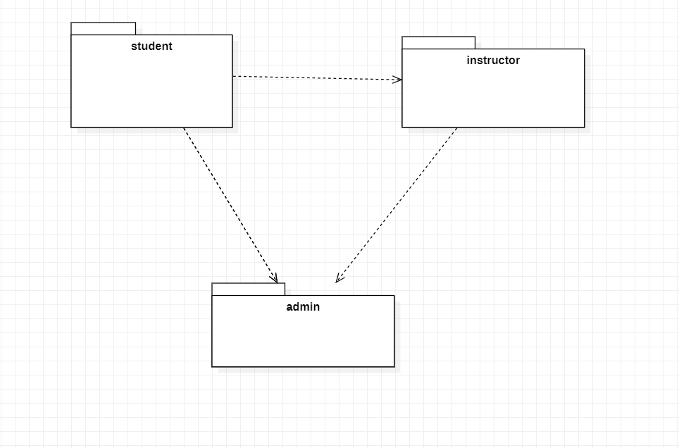
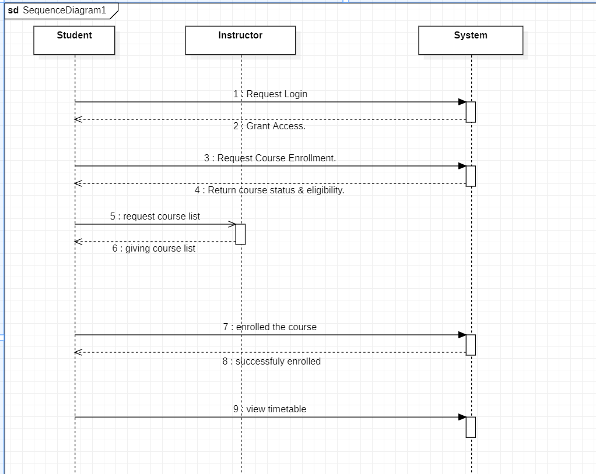
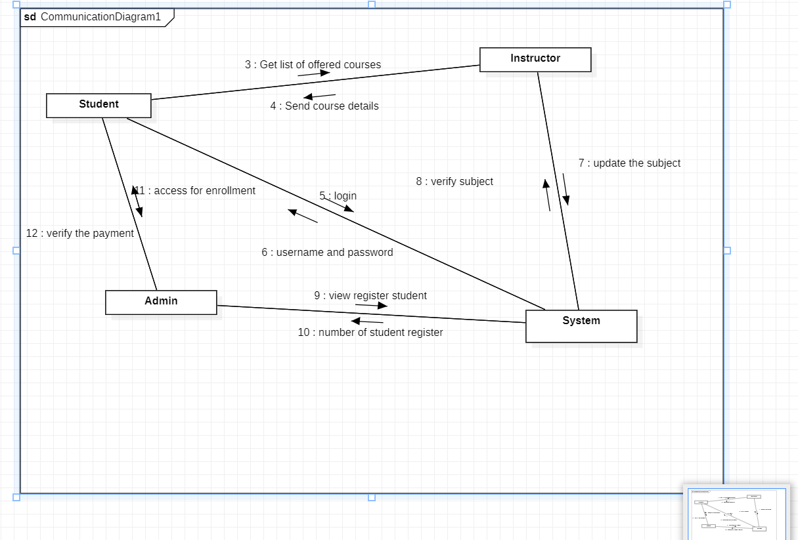

# Exp - 5 STUDENT ENROLLMENT SYSTEM

# AIM:
To study the problem statement, SRS document and draw all the UML diagrams of a Student Enrollment Management System.

# SRS (Procedure):
To create Student Enrollment System software that will meet the needs of the applicant and help them with student registration, course enrollment, modification in the database, and cancellation of registered courses or enrollment records.

# DIAGRAMS:
(upload all 6 diagrams)

# USE CASE DIAGRAM:

# CLASS DIAGRAM:

# ACTIVITY DIAGRAM:

# PACKAGE DIAGRAM:

# SEQUENCE DIAGRAM:

# COMMUNICATION DIAGRAM:

# RESULT:
Thus the Student enrollment management system project was executed and the output was verified.